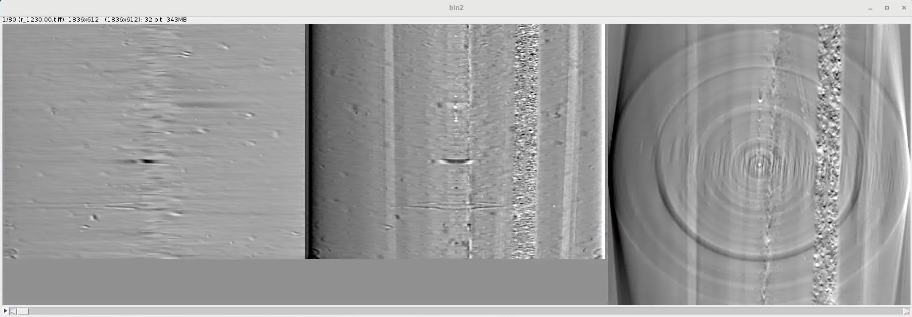

========
Orthorec
========

`orthorec <https://github.com/xray-imaging/orthorec>`_ reconstructs 3 orthogonal slices in position (idx, idy, idz) with multiple position of the rotation axis center as set by (center, center-search-step, center-search-width) ::

The output of **orthorec** is a series of 3 orthogonal slices that can be loaded as a stack in imageJ to determine the best rotation axis location while looking simultaneously at the 3 slices:

    
Dependencies
------------

cupy, h5py, dxchange

Installation
------------

First, you must have `Conda <https://docs.conda.io/en/latest/miniconda.html>`_
installed.

Next, create a new Conda environment called ``orthorec`` by running::

    $ conda create --name orthorec

and activate it::

    $ conda activate orthorec

then install the orthorec dependecies (cupy, h5py, dxchange) and orthorec::

    $ git clone https://github.com/xray-imaging/orthorec.git
    $ cd orthorec
    $ python setup.py install

Usage
-----

::

    $ orthorec -h
    
    usage: orthorec [-h] [--config FILE]  ...

    optional arguments:
      -h, --help     show this help message and exit
      --config FILE  File name of configuration

    Commands:
      
        init         Create configuration file
        show         Show status
        recon        Start ortorec

    $ orthorec init
        Creates a orthorec.conf default file

    $ orthorec show 
        Show the last used orthorec parameters

    $ orthorec recon -h
    usage: orthorec recon [-h] [--bin-level BIN_LEVEL] [--center CENTER] [--center-search-step CENTER_SEARCH_STEP] 
                          [--center-search-width CENTER_SEARCH_WIDTH] [--file-name PATH]
                          [--idx IDX] [--idy IDY] [--idz IDZ] [--pchunk PCHUNK] [--config FILE] [--logs-home FILE] [--verbose]

  optional arguments:
    -h, --help            show this help message and exit
    --bin-level BIN_LEVEL
                          binning level (default: 2)
    --center CENTER       Center seach start location (pixel) (default: 1024)
    --center-search-step CENTER_SEARCH_STEP
                          Center search step size (pixel) (default: 0.5)
    --center-search-width CENTER_SEARCH_WIDTH
                          +/- center search width (pixel) (default: 20.0)
    --file-name PATH      Name of the last used hdf file or directory containing multiple hdf files (default: .)
    --idx IDX             Index of the X ortho slice to reconstruct (pixel) (default: 1024)
    --idy IDY             Index of the Y ortho slice to reconstruct (pixel) (default: 1024)
    --idz IDZ             Index of the Z ortho slice to reconstruct (pixel) (default: 1024)
    --pchunk PCHUNK       Size of a projection chunk (to fit data into GPU memory), e.g., data size is (1500,2048,2448), pchunk=100 gives splitting data into chunks (100,2048,2448) that
                          are processed sequentially by a GPU (default: 32)
    --config FILE         File name of configuration (default: /home/beams/TOMO/orthorec.conf)
    --logs-home FILE      Log file directory (default: /home/beams/TOMO/logs)
    --verbose             Verbose output (default: True)

Example
-------

Reconstruct 3 orthogonal slices in position (idx, idy, idz) with multiple position of the rotation axis center (center, center-search-step, center-search-width)::

    $ orthorec recon --file-name /local/data/2020-12/Zenyuk/4_1_001.h5 --idx 1024 --idy 1024 --idz 1024 --center 1250 --center-search-step 0.5 --center-search-width 20 --bin-level 2
    2021-01-06 17:46:00,648 - Started orthorec
    2021-01-06 17:46:00,649 - Saving log at /home/beams/TOMO/logs/orthorec_2021-01-06_17:46:00.log
    2021-01-06 17:46:00,658 - Reconstruct /local/data/2020-12/Zenyuk/4_1_001.h5
    2021-01-06 17:46:00,671 -    Try centers from  307.500000 to 317.500000 in 0.125000 pixel
    2021-01-06 17:46:00,672 -    Center location and search windows are scaled by a binning factor of 2
    2021-01-06 17:46:05,238 -    *** Time read data from memory: 4.05 s
    2021-01-06 17:46:13,826 -    *** Time reconstruction of orthoslices: 8.59 s
    2021-01-06 17:46:14,287 -    *** Time cpu-gpu copy and save reconstructed orthoslices: 0.46 s
    2021-01-06 17:46:14,287 - Output files: /local/data/2020-12/Zenyuk_rec/3D/try_rec/4_1_001/bin2/ 

To run a different data set with the same parameters::

    $ orthorec recon --file-name /local/data/2020-12/Zenyuk/4_1_002.h5

To run a folder of data sets with the same parameters::

    $ orthorec recon --file-name /local/data/2020-12/Zenyuk/
    2021-01-06 18:19:48,977 - Started orthorec
    2021-01-06 18:19:48,977 - Saving log at /home/beams/TOMO/logs/orthorec_2021-01-06_18:19:48.log
    2021-01-06 18:19:48,985 - Found: ['4_1_001.h5', '4_1_002.h5']
    2021-01-06 18:19:48,985 - Reconstruct /local/data/2020-12/Zenyuk/4_1_001.h5
    2021-01-06 18:19:49,000 -    Try centers from  307.500000 to 317.500000 in 0.125000 pixel
    2021-01-06 18:19:49,000 -    Center location and search windows are scaled by a binning factor of 2
    2021-01-06 18:19:54,088 -    *** Time for reading data from memory: 4.62 s
    2021-01-06 18:20:03,134 -    *** Time for orthoslice reconstruction: 9.05 s
    2021-01-06 18:20:03,658 -    *** Time for cpu-gpu copy and save reconstructed orthoslices: 0.52 s
    2021-01-06 18:20:03,658 - Output files: /local/data/2020-12/Zenyuk_rec/3D/try_rec/4_1_001/bin2/ 
    2021-01-06 18:20:04,141 - Reconstruct /local/data/2020-12/Zenyuk/4_1_002.h5
    2021-01-06 18:20:04,142 -    Try centers from  307.500000 to 317.500000 in 0.125000 pixel
    2021-01-06 18:20:04,142 -    Center location and search windows are scaled by a binning factor of 2
    2021-01-06 18:20:08,948 -    *** Time for reading data from memory: 4.41 s
    2021-01-06 18:20:12,563 -    *** Time for orthoslice reconstruction: 3.61 s
    2021-01-06 18:20:13,342 -    *** Time for cpu-gpu copy and save reconstructed orthoslices: 0.78 s
    2021-01-06 18:20:13,342 - Output files: /local/data/2020-12/Zenyuk_rec/3D/try_rec/4_1_002/bin2/ 
